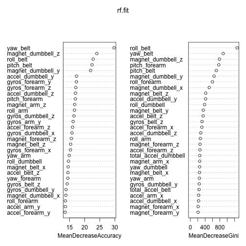

PML Project
========================================================

The data has been sourced from : http://groupware.les.inf.puc-rio.br/har.
The model developed in this document could accurately predict all 20 test cases.

## Preprocessing
- Remove all derived variables as they will only add noise.
- Remove all new_window=yes rows - only 400 odd - since there is no explaination of the readings and the statitstics (min - max etc) are wrong for the few windows that I tried
- Remove windows with less than 10 readings - 504 rows.
- Split sets into training and testing.

Having clean data, we split it into 75% training and 25% testing data frames. This way, we keep aside some data for later cross validation and estimating out of sample errors.


##Exploration
Exploratory plots of smaller subsests such as
- plot(sub1$roll_belt~sub1$num+window, col=as.numeric(sub1$classe)+3)
were drawn (over 50). (Not included due to length limitation.)

They showed that the RANGE (not value of each reading) of "pitch_arm","yaw_arm","yaw_dumbbell", "roll_belt", "roll_arm", "roll_dumbbell", "total_accel_arm", "total_accel_belt", "total_accel_forearm", "total_accel_dumbbell" can predict the class.
- Since we are checking hip throw(class E), elbow throw(class B), partial lifts(class C) and partial lowerings(class D), this made semse. So we will only take max and min readings from a window. And fit a randomForest.


```
## Warning: package 'randomForest' was built under R version 3.1.1
```

```
##    pred
##       A   B   C   D   E
##   A 235   1   0   2   0
##   B  14 144   2   1   1
##   C   8   1 129   6   0
##   D   5   0   5 126   1
##   E   2   1   0   1 150
```
However, this gives a out of sample testset fit of - 

  About 10% error.
  So we need to improve identification of C and D - which are halfway lift and halfway lower mistakes.
  
  So we will try another way to find significant predictors. This time, we use the importance of predictors. And plot the same.
  
 
Thus we obtain best random forest predictors in decreasing order of importance and pick only the first 10 of them to actually model.

```
##    pred1
##        A    B    C    D    E
##   A 1363    3    1    2    0
##   B    4  909    5    1    0
##   C    1    1  797    4    0
##   D    0    0    5  788    0
##   E    0    7    3    0  884
```

The out of sample accuracy on test set now is -

 
We used this model on the test set supplied. The out of sample errors were 0.


